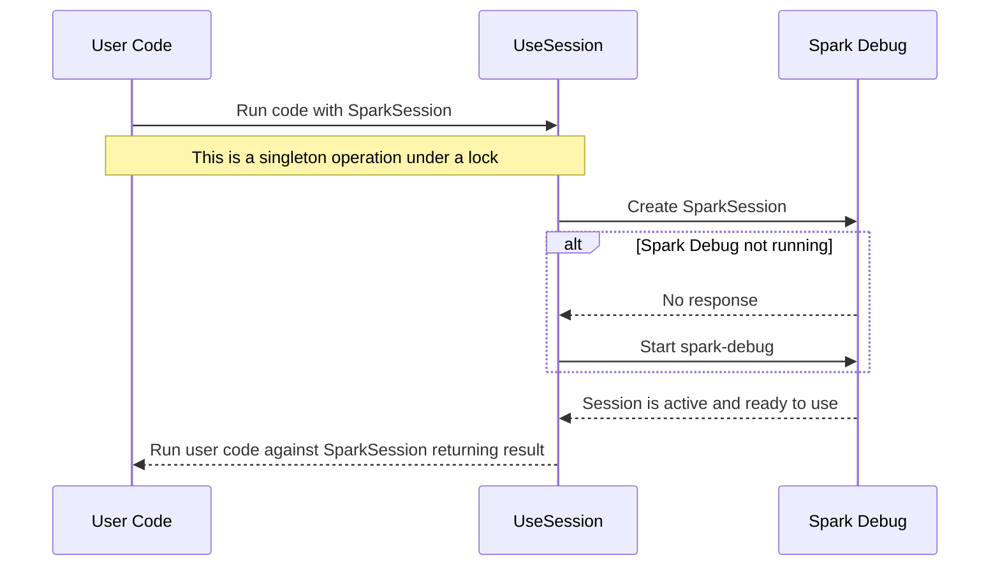

<!-- markdownlint-disable MD033 MD041 -->

# SparkTest.NET

---

Support for testing Spark .NET applications

---

## Why?

There is no documented/supported way to write tests for Spark .NET
applications.

There are a number of foot guns and this aims to disarm them.

* spark-debug needs to run from the executing location of the tests assembly,
  this starts spark-debug in the correct location, and ensures that it is
  stopped after all the tests are complete
  * If spark-debug is already running, it will not be started, good for CI
* spark-debug without any tuning is not optimized for short running tests, this,
  * Sets the log level to Error (default is super chatty)
  * Disables the Spark UI settings
  * Stops Spark from spreading out and localizes work
  * Disables shuffling for Spark SQL
  * Enables all cores on the spark submit job
* @Microsoft.Spark.Sql.SparkSession is not thread safe, its backed by a single
  [SparkContext](https://learn.microsoft.com/en-gb/dotnet/api/microsoft.spark.sparkcontext?view=spark-dotnet),
  this enforces that all operations that need a
  @Microsoft.Spark.Sql.SparkSession run sequentially

## How?

The
[`SparkSessionFactory.UseSession`](xref:SparkTest.NET.SparkSessionFactory.UseSession*)
function will ensure that a spark-debug process is running before returning a
session that will then have exclusive access to Spark to run the user provided
operation.

The following details the sequence of operations,

